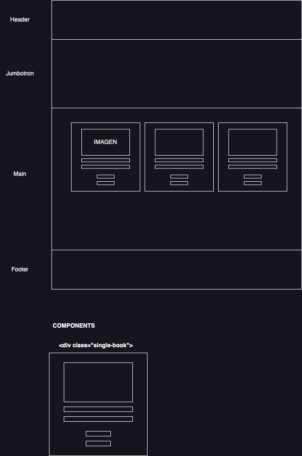
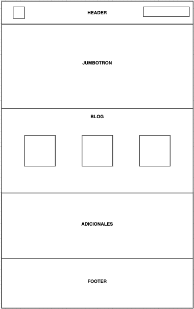

Proyecto Landing de Ventas de Juan Manuel Calleros Solache
-----------------

Dentro de este proyecto generamos ejercicio de aplicacion con lenguajes HTML y CSS.

En el se reflejan temas como HTML 5 utilizando las nuevas sintaxis. 

En CSS se utiliza las bases como clases o ids, seguido de flexbox, grid, asi como la parte responsivas con media query.

Maquetado
---------

En esta imagen a grades razgos se muestra como esta porporcionado el esquema de la pagina web 

pd: gracias al coach Mike Nievas por la imagen.

Todo esto siguiendo los requerimientos del curso como entregables de la siguiente imagen. 

Libreria el Búho 
version v1.0

[def]: image.png